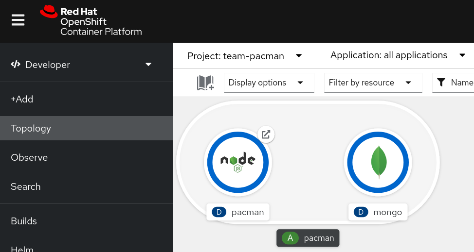
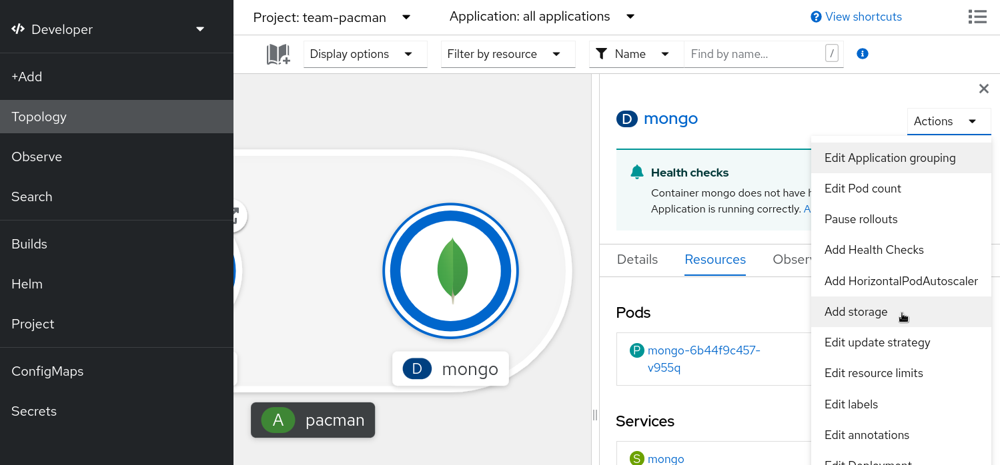
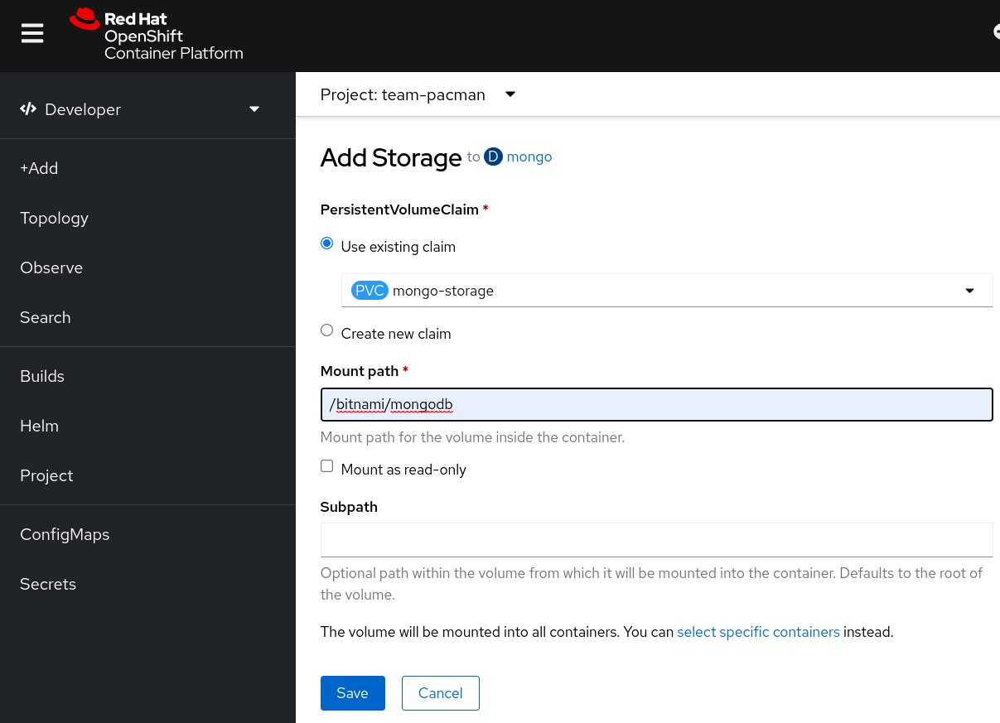
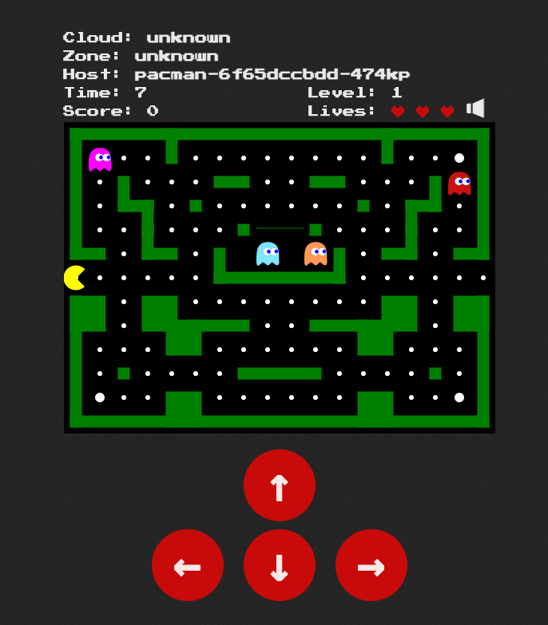

This exercise builds on what we learned from the previous exercise. The goal, to attach storage into our mongo pod to keep our high scores!

Containers are stateless in nature. If our container fails, is redeployed, or rescheduled to another node, any data it was holding is lost. In Kubernetes, we use Persistent Volumes to overcome this, by attaching a [Persistent Volumes](https://kubernetes.io/docs/concepts/storage/persistent-volumes "Kubernetes documentation") to our containers.

Enter the Developer perspective, and enter the Topology view. Switch to project **_username_-team-pacman**.



The mongo deployment is not yet using Persistent Volumes, if the mongo pod restarts, our high scores are lost.

Go ahead and try.


1. Play a Pacman game and hit a high score.
2. Click on the mongo deployment and scale it down to zero pods, and back to one.
3. Go back to Pacman and display the high score leaderboard. What did you find?

Let's add some persistence!

If you are looking for more of a challenge, this exercise has the option to complete using the command line, but does require familiarity with editing [YAML](https://en.wikipedia.org/wiki/YAML).  

The recommended approach is to use the [OpenShift console](#openshift-console-instructions), but those comfortable in a Linux command line feel free to challenge yourself using the [OpenShift command line](#openshift-command-line-instructions).
# OpenShift Console Instructions
[Looking for the command line instructions?](#openshift-command-line-instructions)

## 1. Review the Persistent Volume Claim

Switch to the Administrator perspective, and navigate to `Storage` > `PersistentVolumeClaims`. Reivew the mongo-storage Persistent Volume Claim.

Notice that the Persistent Volume Claim is in a pending state. We are using dynamic provisioning so, the Persistent Volume Claim will be created when a Pod attempts to mount it.

## 2. Mount the Persistent Volume Claim

Switch to the Developer perspective, make sure the current project is `userXX-team-pacman`, navigate to Topology, and bring up the details of the mongo deployment.
Select `Actions` then `Add storage`.



The mongo container image expects an external volume mounted in `/bitnami/mongodb` to store data.

Configure the storage as follows:

| Configuration          | Parameter          |
|------------------------|--------------------|
| Use existing claim     | `mongo-storage`    |
| Mount path             | `/bitnami/mongodb` |
| Mount as read-only     | `untick`           |

Click `Save`



Your deployment will automatically redeploy a new mongo pod with the volume attached.
[Time to test the changes](#test-your-changes)
# OpenShift command line instructions

[Looking for the OpenShift console instructions?](#openshift-console-instructions)

The Persistent Volume Claim object definition already available and ready for you to apply.

```
oc describe pvc mongo-storage
```
Notice that the Persistent Volume Claim is in a pending state. We are using dynamic provisioning so, the Persistent Volume Claim will be created when a Pod attempts to mount it.

Edit the `mongo-deployment.yml` object.

Modify our pod template for mongo to include the `volume`, and a `volumeMount` for the container. [An example can be found in offical documentation](https://docs.openshift.com/container-platform/4.10/storage/understanding-persistent-storage.html#pvc-claims-as-volumes_understanding-persistent-storage) but make sure you set the following parameters correctly.

1. In the container, `volumeMounts` section, the `mountPath` must be `/bitnami/mongodb`
2. In the volume section, `claimName` must match the name of the Persistent Volume Claim, i.e., `mongo-storage`.

Once you have done the required modifications, you can re-apply the mongo Deployment with:

```
oc apply -f team-pacman/mongo-deployment.yaml
```

# Test your changes

Return to the OpenShift console to access Pacman and set yourself a high score.
Check that even after scaling down the mongo pod, the new one automatically created will mount the PVC and display your high score correctly.


