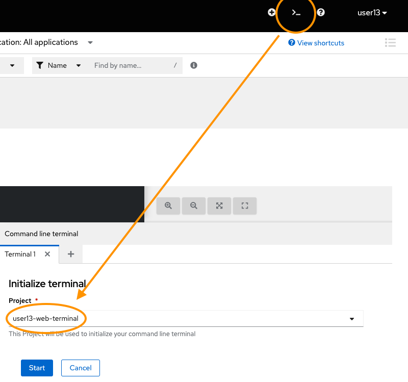

The container-based deployment of the Pacman application worked better than expected, and performance testing completed without any issues.

Another test is happening this weekend, and the delivery team has taken your learnings from the last exercise, and distilled them as [Kubernetes API objects](https://kubernetes.io/docs/concepts/overview/working-with-objects/kubernetes-objects)

Kubernetes objects are persistent entities in the Kubernetes system. Kubernetes uses these entities to represent the state of a cluster. A Kubernetes object is a "record of intent", once you create the object, Kubernetes will constantly work to ensure that object exists. We use YAML notation to describe Kubernetes objects, and are the foundation of infrastructure-as-code practices in Kubernetes.

In the previous exercise, OpenShift created our Kubernetes objects for us, in this exercise will use the Kubernetes objects created by the team since the last test.

## 1. Setup

The delivery team has created a GitHub Gist to download the Kubernetes objects. We'll use a web terminal to retrieve them.



```
curl -sS https://gist.githubusercontent.com/joelapatatechaude/348e52790d9307c11410d5236f9555c0/raw/063749cdd18344adbb41f28aa9faecb04da425f8/setup.sh | bash
```

We can navigate the web terminal like any standard Linux terminal. 
The Kubernetes objects have been downloaded into the team-pacman directory. Enter the directory and review each of the objects and study their composition using your viewer of choice — `cat`, `vi`, `vim` or `nano`.

```
cd team-pacman
ls
```

What do you find common across the objects? 

There are numerous matching labels across all the objects.
A label is a key-pair value tag that can be applied to resources in Kubernetes to give extra meaning or context to that resource for later filtering or selecting.
There are several [recommended labels](https://kubernetes.io/docs/concepts/overview/working-with-objects/common-labels/ "Kubernetes.io Recommended Labels") that are used by Kubernetes including OpenShift to link objects, and visualise the project in the Topology view.

## 1. Deploy the database

Use the terminal to apply the Mongo Deployment and Service.

```
oc project userXX-team-pacman
```

```
oc apply -f mongo-deployment.yml
```

```
oc apply -f mongo-service.yml
```

## 2. Deploy the Pacman application


Use the terminal to apply the Pacman Deployment, Service, and Route.

```
oc apply -f pacman-deployment.yml
```

```
oc apply -f pacman-service.yml
```

```
oc apply -f pacman-route.yml
```

Review to the OpenShift console to review the Topology.

Once the Pacman application is up and running, we can find its route by running:

```
oc get routes
```
## 3. Using a label selector

When we ran `oc get pods` Kubernetes returns all results in the context of the project we are in.

For example, you should see results similar to this:

```
oc get pods
NAME                      READY   STATUS    RESTARTS   AGE
mongo-6f6cbb85f5-g9vt6    1/1     Running   0          12m
pacman-558945b7d8-9kxdx   1/1     Running   0          5m25s
```

What if we are only wanted to return a list of the Mongo pods? Let’s filter using our labels.

```
oc get pods -l app=mongo
```
On a large cluster, it is commonplace for there to have thousands of pods running. Labels provide us a quick and efficient way to find our related resources quickly. We can also group multiple resources together using the label selector.

For example to find all the Replica sets, Pods, and Deployments for Mongo. 

```
oc get replicasets,pods,deployments -l app=mongo
```