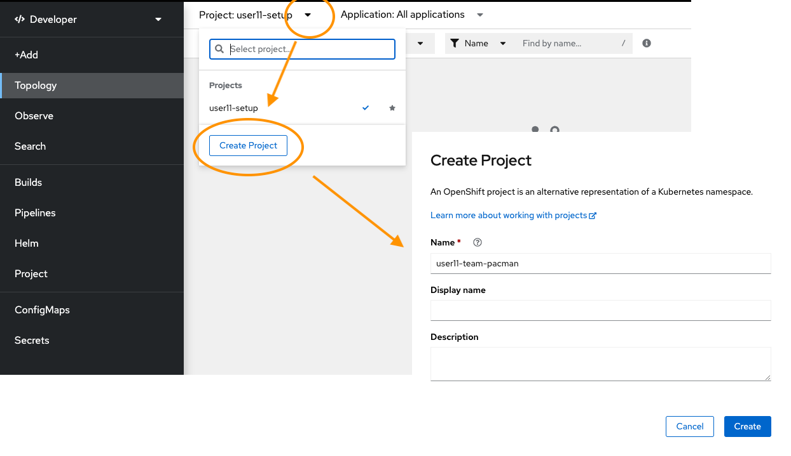

It's closing in on five pm, it's Friday afternoon. Excited about the weekend, you're already making mental notes on what you want to do on Saturday.
One final sweep of the inbox before knock off, a last-minute request comes from one of the application teams.
<blockquote>
  <b>From</b> pacman-development-team 
  <b>To:</b> deployment-engineering 
  <b>Subject:</b> Urgent app deployment  

  Hi deployment team,
    
  Due to project timeline slippages, our next round of testing will be conducted over the weekend. We are also trialling a container-based delivery method of our application.
  Please ensure our application is deployed to the new OpenShift cluster before Saturday morning.
    
  Login details and container images will be sent shortly.
    
  Cheers, 
  Pacman Development Team
</blockquote>
This is the first time you've worked with Kubernetes, and so late on a Friday! Where do you start?

Your task, run the container images using only the OpenShift console.

Another email comes through with details of the OpenShift cluster, and location of the container images.
The email also included specifics of how the containers should be deployed.
You now have all the information you need to deploy the Pacman application.

When you first log in to OpenShift, you will be in the Developer perspective. Explore the interface to find the perspective toggle and switch to the Developer perspective.

Can't find it? Here's a hint.

The Developer perspective draws a focus around the application and microservices for your projects and dissolves the complexity around networking, storage, administration, etc.

### Let's get started.

## 1. Create the project

Projects are a way for teams to organise their applications and content in isolation from other teams.

From the Developer perspective create a new project by clicking on `Create a new project`.
Name the project `userxx-team-pacman`.

More information on Projects can be found in the [working with projects](https://docs.openshift.com/container-platform/4.11/applications/projects/working-with-projects.html "Red Hat OpenShift documentation") section of the OpenShift documentation.

## 2. Deploy the application

You have a quick check of the OpenShift documentation, only to find that there are [numerous ways](https://docs.openshift.com/container-platform/4.11/applications/creating_applications/odc-creating-applications-using-developer-perspective.html "Red Hat OpenShift documentation") to manage an application in a Kubernetes cluster. But since the development team have provided the location of two container images, we can simply deploy from the image.

Click the `+Add` menu item, followed by `Container images`.

Firstly deploy the Mongo container using the following specification.

| Configuration                        | Parameter                 |
|--------------------------------------|---------------------------|
| Image name from external registry    | `quay.io/lijcam/mongo:v1` |
| Runtime icon                         | mongodb                   |
| Application Name                     | pacman                    |
| Name                                 | mongo                     |
| Select the resource type to generate | Deployment                |
| Create a route to the Application    | untick                    |

### The completed form should resemble the following example.

Click the `+Add` menu item, followed by `Container images`.

Deploy the Pacman container using these parameters.

| Configuration                        | Parameter                  |
|--------------------------------------|----------------------------|
| Image name from external registry    | `quay.io/lijcam/pacman:v1` |
| Runtime icon                         | nodejs                     |
| Application Name                     | pacman                     |
| Name                                 | pacman                     |
| Select the resource type to generate | Deployment                 |
| Create a route to the Application    | tick                       |

### The completed form should resemble the following example.

# 3. Verifying our application is available

After completing our deployments, we can return to the topology screen. You will notice that the Pacman container has a small arrow symbol to the right of it. This links to the route of the application. Pressing this will take you to the Pacman application.

What OpenShift has done behind the scenes is taken care of all the plumbing — the networking, services, routes, and deployments. We can export those objects from OpenShift and use them to form the basis of an infrastructure-as-code practice around our application.